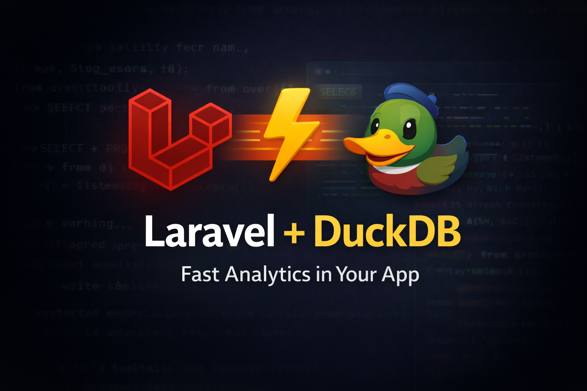

# Laravel DuckDB Driver
A production-ready Laravel database driver for DuckDB, powered by `satur/duckdb-auto`. This package allows you to query DuckDB databases using Laravel's powerful Query Builder for analytical (OLAP) workloads.

## Requirements

- PHP 8.2+
- Laravel 10.0+ or 11.0+
- **FFI Extension Enabled** (`ffi.enable=true` or `preload` in `php.ini`)

> [!WARNING]
> **Production Notice**: Enabling FFI globally (`ffi.enable=true`) can have security implications. It is recommended to use `ffi.enable=preload` in production environments and preload the necessary scripts if possible, or strictly control access to the server.

## Installation

1. Install via Composer:

```bash
composer require laravel-duckdb/duckdb-driver
```

2. Configuration

Add the connection configuration to your `config/database.php` file:

```php
'connections' => [
    
    'duckdb' => [
        'driver' => 'duckdb',
        'database' => env('DUCKDB_DB_FILE', storage_path('duckdb/analytics.db')),
        'prefix' => '',
        'read_only' => false,
    ],

],
```


## Usage

You can use the `DB` facade to interact with DuckDB.

### Querying Files

You can query files directly (Parquet, CSV, JSON) without pre-configuring tables using the `file()` helper:

```php
use Illuminate\Support\Facades\DB;

// Query a Parquet file
$users = DB::connection('duckdb')
    ->file('storage/app/data.parquet')
    ->where('age', '>', 25)
    ->get();

// Or get all records from a file
$allUsers = DB::connection('duckdb')->all('storage/app/data.parquet');

// Print formatted output (useful for debugging)
DB::connection('duckdb')->print("SELECT * FROM 'storage/app/data.parquet' LIMIT 10");

// Or chain print() on a query builder
DB::connection('duckdb')->file('storage/app/data.parquet')->print();
```

### Basic Queries

```php
use Illuminate\Support\Facades\DB;

// Select all users
$users = DB::connection('duckdb')->table('users')->get();

// Aggegrations
$count = DB::connection('duckdb')->table('events')->count();
```

### Analytical Queries (OLAP)

DuckDB shines at analytics. You can query Parquet, CSV, or JSON files directly.

```php
// Querying a Parquet file directly
$results = DB::connection('duckdb')
    ->select("SELECT * FROM 'path/to/data.parquet' LIMIT 10");


### Examples

```php
use Illuminate\Support\Facades\DB;

// 1. Get all users
$users = DB::connection('duckdb')->table('users')->get();

// 2. Aggregate count
$count = DB::connection('duckdb')->table('users')->count();

// 3. Conditional Fetch with Bindings
$user = DB::connection('duckdb')
    ->table('users')
    ->where('id', 1)
    ->first();

// 4. Raw SQL Select
$results = DB::connection('duckdb')->select("SELECT * FROM users WHERE email LIKE ?", ['%example.com']);

// 5. Analytical Query (DuckDB syntax)
// e.g. Extract hour from timestamp
$hourly = DB::connection('duckdb')
    ->select("SELECT date_part('hour', created_at) as hour, count(*) as count FROM users GROUP BY 1");
```


### Limitations

- **No Eloquent Support**: This driver is designed for **read-heavy analytical workloads**. Eloquent ORM features (Models, Relationships, saving models) are **not supported** and usually incompatible with DuckDB's constraints and lack of certain OLTP features. Use the Query Builder.
- **Transactions**: DuckDB handles transactions differently. Nested transactions or complex locking expected by standard Laravel apps might not work as intended.
- **FFI Binding Interpolation**: Due to the nature of the FFI integration, prepared statements with placeholders are emulated by valid string interpolation within the driver. Use caution with raw queries.

## Security

Ensure your `php.ini` has FFI enabled:

```ini
[ffi]
ffi.enable=true
```


## Testing

To run the test suite, make sure you have installed the dependencies:

```bash
composer install
```

Then run PHPUnit:

```bash
vendor/bin/phpunit
```

